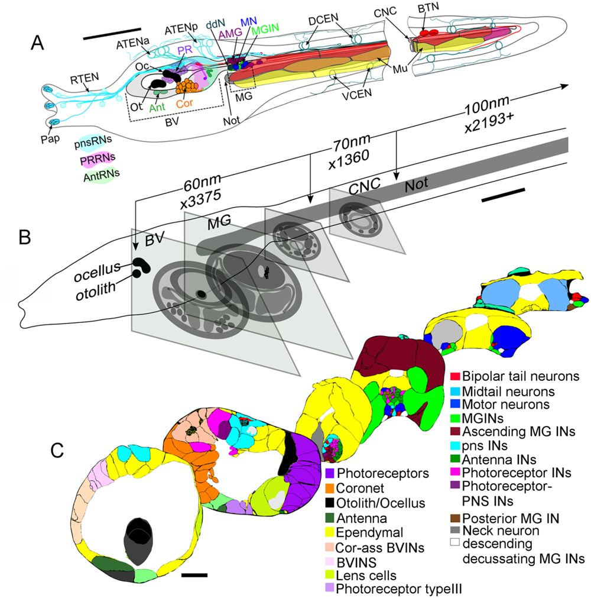
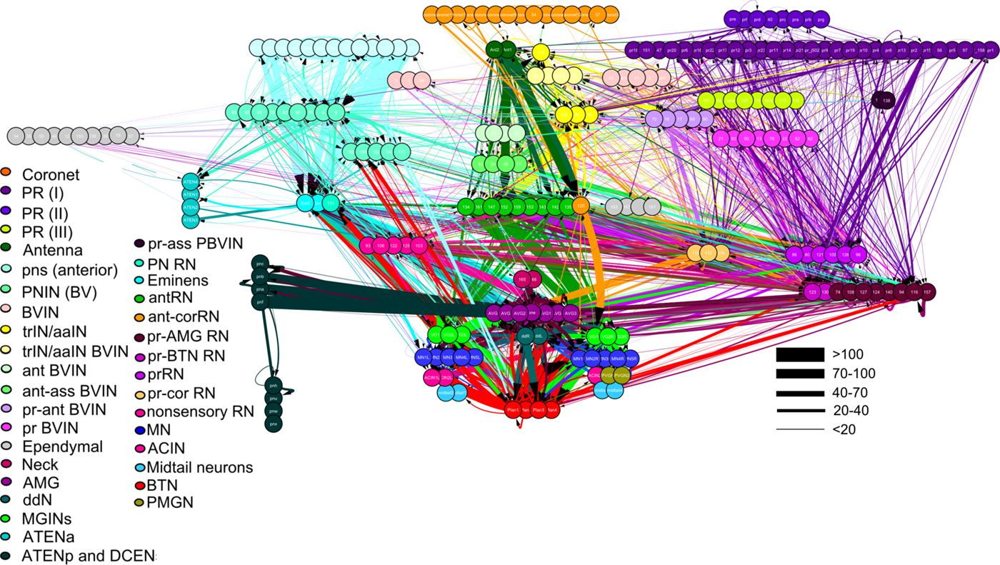
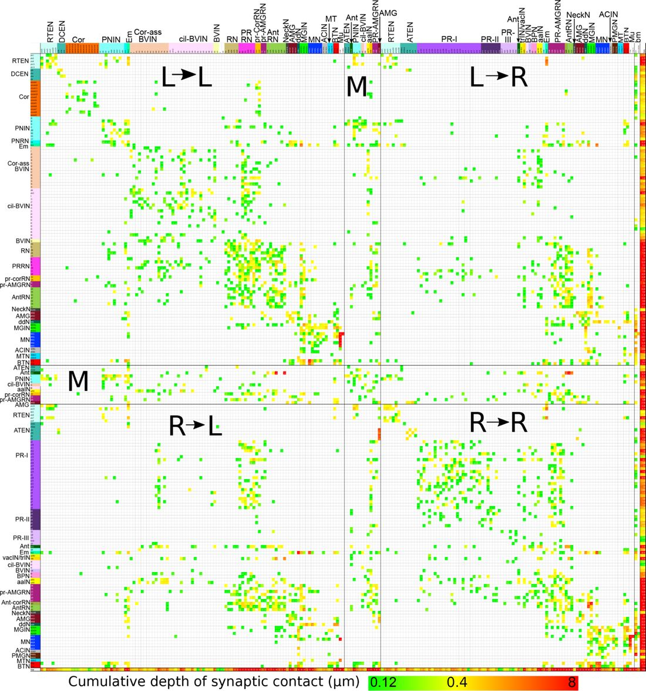

# CionaBrain

**A tiny chordate nervous system, living continuously on the open web.**

CionaBrain is an interactive simulation built around the published synaptic
connectome of a larval *Ciona intestinalis*. It simulates all 177 neurons in the
central nervous system, lets sensory events propagate through the measured
directed network, and turns left/right motor activity into movement in a small
two-dimensional world.

<p align="center">
  <a href="https://doi.org/10.7554/eLife.16962.004">
    
  </a>
</p>
<p align="center"><sub>
  Larval anatomy, CNS regions and serial-section reconstruction. Ryan, Lu &amp;
  Meinertzhagen (2016), Figure 1. <a href="https://doi.org/10.7554/eLife.16962.004">Original figure and caption</a> · CC BY 4.0.
</sub></p>

By default, everyone watches and interacts with the same server-authoritative
larva. Its neural clock keeps advancing when a viewer disconnects. A separate
Local lab mode creates a private browser Worker for ablation, replay and model
experiments.

The shared generation also runs an explicitly experimental reward-modulated
plasticity rule on observed sensory/interneuron inputs to MGIN and motor neurons.
It rewards reduced distance to the modeled light. This adaptation changes only
bounded gain factors (0.7–1.3×), never the Ryan connectome topology, and must not
be interpreted as a measured learning rule or natural behavioral objective.

The interesting part is not that this animal has very few neurons. It is that
it is a **chordate** with a compact nervous system that can be followed from
sensation to action almost cell by cell.

## What is this animal?

*Ciona* is a sea squirt, or ascidian: a marine tunicate and a close living
relative of vertebrates. The adult is a stationary filter-feeder, but its brief
larval stage looks and moves like a tadpole. The roughly millimetre-long larva
has several features that define the chordate body plan:

- a notochord running through the tail;
- a dorsal, hollow central nervous system;
- muscles arranged on the left and right sides of the tail;
- an anterior sensory region connected to a motor ganglion and caudal nerve
  cord.

The larva does not feed. It swims for a short period, responds to light,
gravity, shadows and mechanical cues, then attaches to a suitable surface and
metamorphoses into the very different adult form.

## Why 177 neurons are enough to be interesting

Ryan, Lu and Meinertzhagen reconstructed the larval CNS from serial-section
electron microscopy. Their 2016 study identified **177 CNS neurons**, thousands
of chemical synapses, neuromuscular junctions and putative gap junctions.

<p align="center">
  <a href="https://doi.org/10.7554/eLife.16962.024">
    
  </a>
</p>
<p align="center"><sub>
  Complete network of synaptic pathways in the larval CNS; arrows show
  direction and line width indicates synaptic contact depth. Ryan, Lu &amp;
  Meinertzhagen (2016), Figure 7—figure supplement 1.
  <a href="https://doi.org/10.7554/eLife.16962.024">Original figure and caption</a> · CC BY 4.0.
</sub></p>

This is not a miniature bilaterally mirrored brain. Its left and right sides
contain different neuron identities and different pathways even where total
cell counts are similar. The brain vesicle includes a right-sided ocellus and
left-sided coronet cells, while asymmetric sensorimotor projections can produce
different activity on the two sides of the swimming system.

That combination—small, chordate and visibly asymmetric—is what CionaBrain is
designed to make explorable.

<p align="center">
  <a href="https://doi.org/10.7554/eLife.16962.042">
    
  </a>
</p>
<p align="center"><sub>
  Connectivity matrix sorted by left and right sides—the source view behind
  CionaBrain's laterality emphasis. Ryan, Lu &amp; Meinertzhagen (2016),
  Figure 16—figure supplement 1.
  <a href="https://doi.org/10.7554/eLife.16962.042">Original figure and caption</a> · CC BY 4.0.
</sub></p>

## What you can explore

- **One shared live organism.** A persistent server process advances the same
  177-neuron Leaky Integrate-and-Fire state for every connected observer.
- **An autonomous sensory world.** When visitors stop interacting, the modeled
  light, gravity and contact fields continue changing around the larva.
- **An embodied larva.** Light position, gravity direction and touch location
  generate sensory input; left/right motor output changes the larva's path.
- **Neural laterality.** Neurons are grouped by left, right and unlabelled
  identities, with an explicit laterality score for motor output.
- **Interventions.** Apply unilateral stimuli, ablate motor-related neurons and
  compare baseline activity with an intervention.
- **Circuit inspection.** Select a neuron to trace observed directed paths from
  sensory input toward that target.
- **Reproducible experiments.** Record and replay stimuli, sign rules,
  ablations, seeds and results; export sessions as JSON or CSV.
- **Alternative sign models.** Compare an all-excitatory network with a
  documented inhibition heuristic or an explicitly experimental random-sign
  control.

## What is measured, derived or assumed?

CionaBrain deliberately keeps the source connectome separate from the model
wrapped around it.

| Layer | What it includes |
| --- | --- |
| **Measured** | Neuron identities, directed contacts, cumulative presynaptic contact depth and explicit `L`/`R` labels from the Ryan et al. dataset. |
| **Derived** | Log-scaled simulation weights, activity paths, motor grouping and the left/right laterality score. |
| **Heuristic** | Inhibitory signs where no complete physiological sign annotation is available, stimulus-to-neuron mappings, sensory transduction and larval movement physics. |
| **Experimental** | Random inhibitory controls, ablations, optional class-level synaptic-gain optimization and reward-modulated plasticity. |

The public Netzschleuder representation contains 205 nodes and 2,903 directed
edges. CionaBrain removes peripheral input nodes and non-CNS tail targets to
simulate the 177 CNS neurons described in the paper. Edge weight is cumulative
contact depth—not a directly measured synaptic conductance.

Synaptic signs are not fully annotated in the original connectome. The
inhibition modes in this project are transparent modeling choices, not a claim
that the complete excitatory/inhibitory physiology is known.

## Selected reading

1. **Ryan K, Lu Z, Meinertzhagen IA (2016).**
   [*The CNS connectome of a tadpole larva of Ciona intestinalis (L.) highlights sidedness in the brain of a chordate sibling.*](https://doi.org/10.7554/eLife.16962)
   eLife 5:e16962. The foundational serial-EM connectome used by this project;
   it documents the 177 CNS neurons and their pronounced left/right asymmetry.

2. **Salas P, Vinaithirthan V, Newman-Smith E, Kourakis MJ, Smith WC (2018).**
   [*Photoreceptor specialization and the visuomotor repertoire of the primitive chordate Ciona.*](https://doi.org/10.1242/jeb.177972)
   Journal of Experimental Biology 221:jeb177972. Connects distinct
   photoreceptor groups to phototaxis and dimming responses.

3. **Rudolf J, Dondorp D, Canon L, Tieo S, Chatzigeorgiou M (2019).**
   [*Automated behavioural analysis reveals the basic behavioural repertoire of the urochordate Ciona intestinalis.*](https://doi.org/10.1038/s41598-019-38791-5)
   Scientific Reports 9:2416. Quantifies larval movement and identifies a richer
   behavioural repertoire than neuron count alone might suggest.

4. **Bostwick M et al. (2020).**
   [*Antagonistic inhibitory circuits integrate visual and gravitactic behaviors.*](https://doi.org/10.1016/j.cub.2019.12.017)
   Current Biology 30:600–609.e2. Uses connectomic, neurotransmitter and
   behavioural evidence to propose asymmetric inhibitory control of
   light-triggered gravitaxis.

5. **Chung J et al. (2023).**
   [*A single oscillating proto-hypothalamic neuron gates taxis behavior in the primitive chordate Ciona.*](https://doi.org/10.1016/j.cub.2023.06.080)
   Current Biology 33:3360–3370.e4. Shows how the activity of one identified
   inhibitory neuron can gate a visually guided behavior.

### Connectome data

- [Interactive dataset and CSV/GraphML downloads on Netzschleuder](https://networks.skewed.de/net/cintestinalis)
- [Ryan et al. article, figures and source data on eLife](https://elifesciences.org/articles/16962)

The upstream dataset is distributed under CC BY 4.0. Please cite Ryan, Lu and
Meinertzhagen (2016) when using or redistributing the connectome data.

### Figure credits

All three figures displayed above are reproduced from Ryan, Lu and
Meinertzhagen, *eLife* 5:e16962 (2016), under the paper's
[CC BY 4.0 license](https://creativecommons.org/licenses/by/4.0/). They were
retrieved through eLife's official IIIF service and downscaled only for README
display; no labels, scientific content or interpretive overlays were added.

## Run locally

Requires Node.js 20 or newer. Python is not required.

```bash
npm install
npm run check
npm run build
npm start
```

Open <http://127.0.0.1:8765>.

### Docker

The repository includes a multi-stage, non-root production image with a built-in
health check. Start it with Compose:

```bash
docker compose up -d --build
```

The simulator is then available at <http://127.0.0.1:8765>; set
`CIONABRAIN_PORT` to publish another host port. The health endpoint is
`/api/health`, and reverse proxies must forward WebSocket upgrades for `/ws`.

```bash
CIONABRAIN_PORT=8080 docker compose up -d --build
docker compose ps
```

### Concurrent viewers

The server is configured for at least 100 simultaneous viewers (250 by
default). It serializes each state once, skips backlogged clients, terminates
stalled sockets with WebSocket heartbeat checks, and broadcasts at a
configurable 8 Hz. Capacity-related environment variables are
`MAX_VIEWERS`, `BROADCAST_HZ`, and `MAX_BUFFERED_BYTES`.

Run the included 100-client WebSocket check against a deployed instance:

```bash
npm run load-test
# or: TARGET_URL=wss://example.org/ws CLIENTS=100 npm run load-test
```

## Implementation note

The interface is written in TypeScript. Neural state lives in a Web Worker, so
the Local lab remains private and inexpensive. Shared live mode runs one
authoritative `Simulator` on the Node server and broadcasts its state to all
observers over WebSocket. Public visitors can provide sensory input, while
reset, ablation, sign changes and replay remain isolated to Local lab mode.
